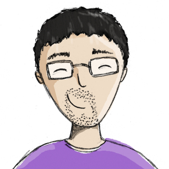
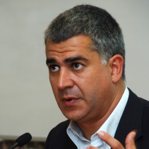

---
hide:
  - navigation
  - toc
---

# Members

## Current members

-   __Juan Antonio Pérez-Ortiz__

    ---

    {: align=left style="height:150px;width:150px"}

    **Position**: associate professor, head of the Transducens Research Group.

    **Research areas**: machine translation.

    **Interests**: machine translation, natural language processing, active machine learning, crowdsourcing, web 2.0, fractal geometry.

    [:octicons-arrow-right-24: Personal page](http://www.dlsi.ua.es/~japerez/)

-   __Felipe Sánchez-Martínez__

    ---

    {: align=left style="height:150px;width:150px"}

    **Position**: associate professor.

    **Research areas**: machine translation.

    **Interests**: machine translation, low-resource machine translation, computer aided translation.

    [:octicons-arrow-right-24: Personal page](http://www.dlsi.ua.es/~fsanchez/)

## Students

## PhD Students

## Technical staff

## Visitors and collaborators

## Former members

-   __Mikel L. Forcada__

    ---

    {: align=left style="height:150px;width:150px"}

    **Position**: full professor

    **Research areas**: machine translation.

    **Interests**: machine translation, natural language processing, computer-aided translation.

    [:octicons-arrow-right-24: Personal page](http://www.dlsi.ua.es/~mlf/)

## Former students

